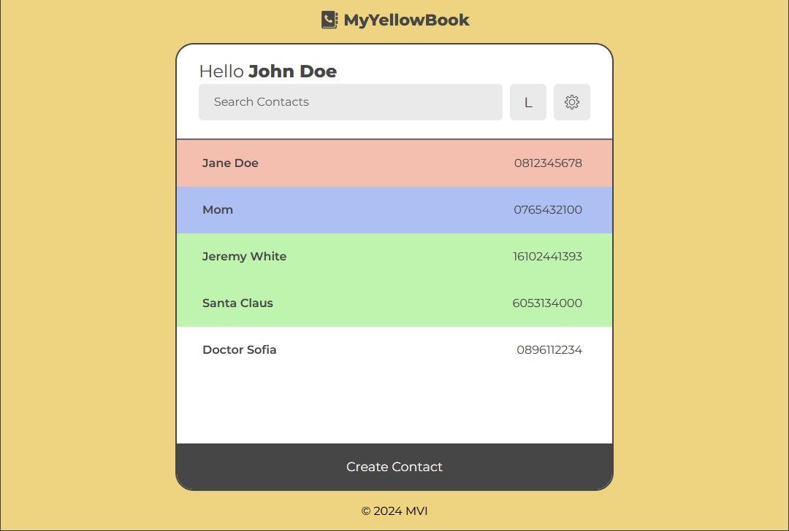

CSCB532_Traykov_Address_Book
# MyYellowBook

A single page "address book" web app made with React and Spring, allowing users to store, organize, search, edit and delete their contacts with a simple and intuitive user interface.



## Developers:

- **Simeon** - Back End Development (User Logic), Testing, Documentation
- **Vladislav** - Team Leader and Project Manager, Back End Development (Contacts Logic)
- **Ivaylo** - Front End Development, UI Design and Branding

## Folder Organization:

- `/Address_Book` - Source code for back end.
- `/Address_Book_UI` - Source code for front end.
- `/Documentation` - Project documentation.

## Run the project locally

*Prerequisites: You must have jdk-17 and npm installed and set-up on your system.*

To run the **back end** server, open a terminal in the `/Address_Book` directory and execute the command:
```
.\mvnw spring-boot:run
```

Then, to run the **front end** server, open another terminal in the `/Address_Book_UI` directory and execute the following commands:

```powershell
npm i #install dependencies
npm run dev #runs server in developer mode
```

You can then access the app at http://localhost:5173/.